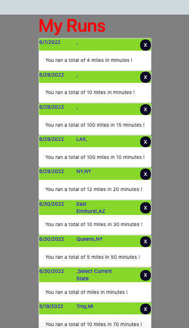
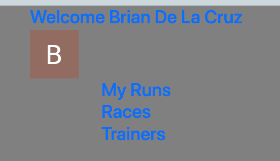

# Brian-Delacruz-workout-planner

##Contents: 

 - Objective
 - Getting Started
 - Links
 - Screenshots
 - Technologies Used
 - Credits

##Objective:
To create a functional, user friendly application that anyone can use. This workout planner alows you to track your runs/workouts and log/see upcoming races in a database. 

##Getting Started: 
Link to [Heroku] - [https://brian-delacruz-workout-planner.herokuapp.com/]

Link to [Trello] - [https://trello.com/b/QxjIte8Y/brian-delacruz-workout-planner]

##Screenshots: 

##Technologies Used:

##Next Steps: (icebox items)