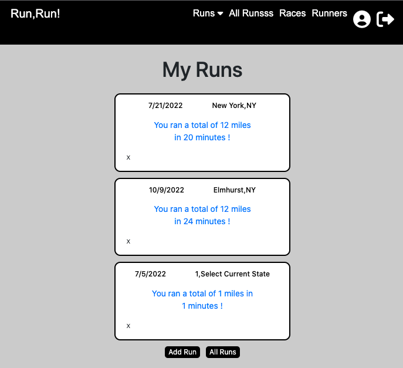
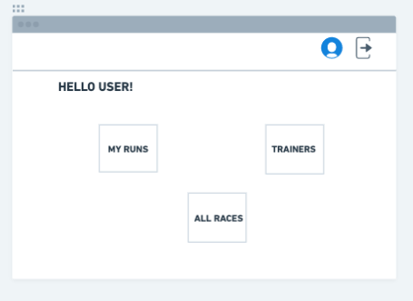
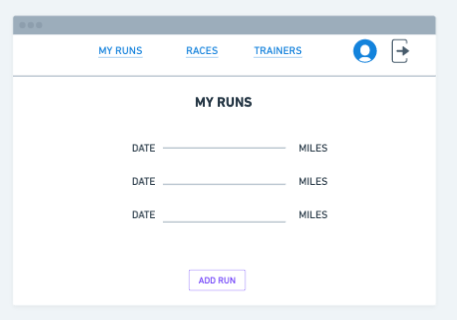
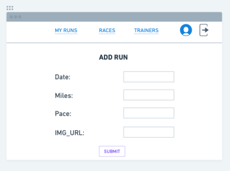
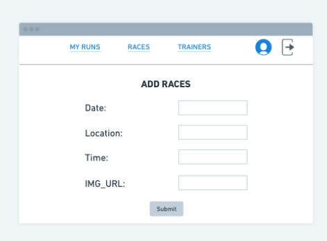
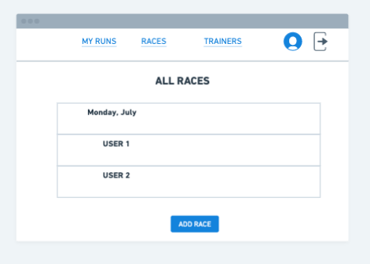
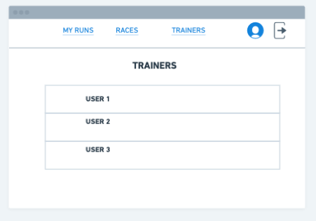
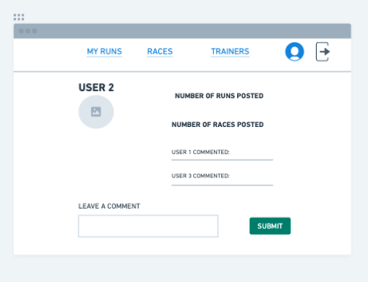
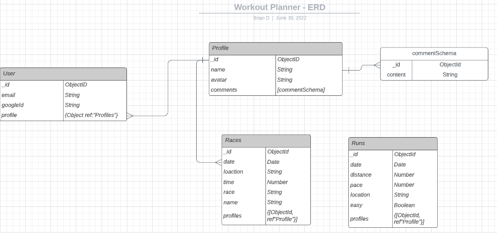

# Brian-Delacruz-workout-planner

# Contents: 

 - Objective
 - Getting Started
 - Links
 - Screenshots
 - Technologies Used
 - Credits

# Objective:
To create a functional, user friendly application that anyone can use. This workout planner alows you to track your runs/workouts and log/see upcoming races in a database. 

# Motivation 
As an avid runner and rock climber, I wanted to incorporate these hobbies into my application. I wanted to be able to plan and track my workouts in a simple convenient database. 

# Visit the app: 
Link to [Heroku] - [https://brian-delacruz-workout-planner.herokuapp.com/]

Link to [Trello] - [https://trello.com/b/QxjIte8Y/brian-delacruz-workout-planner]

# Screenshots: 

# Wireframes:

[https://whimsical.com/brian-delacruz-workout-planner-PwPm4qNcyCkzGy3nqnkMJ]

# ERD: 

# Technologies Used:
- JavaScript
- Mongoose
- MongoDB
- Express JS
- HTML
- CSS
- Bootstrap
- Fontawesome Kit

# Next Steps: (icebox items)

- AAU, when I navigate to a 'Profile' I should see how many runs and races the profile has logged. 